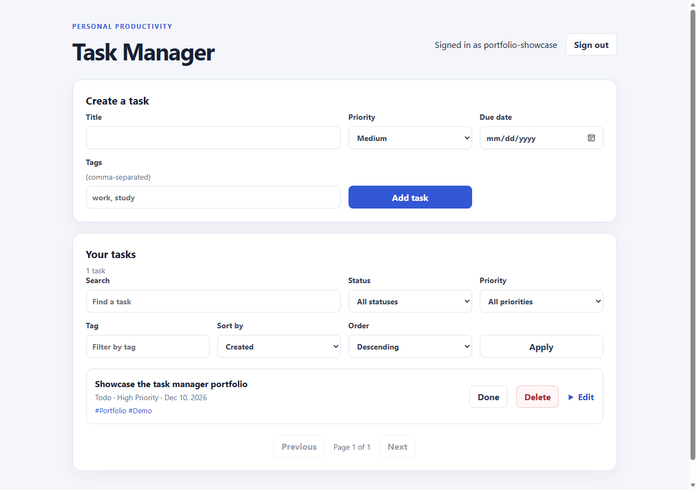

# Personal Task Manager

Full-stack JavaScript portfolio project.

## Featured portfolio project

**[Personal Task Manager](project/README.md)** is a full-stack JavaScript app
with registration and login, private per-user tasks, search and filters, an
Express REST API, MongoDB, automated tests, and Docker.



**Stack:** JavaScript, Node.js, Express, MongoDB, HTML, CSS, Docker Compose.
The project currently offers a local Docker demo; there is no hosted public
demo yet.

### Try the demo locally

Requirements: Git, Docker Desktop, and an internet connection for the first
image download. Install Git, start Docker Desktop, then run these commands in
PowerShell:

```powershell
git clone https://github.com/Dangne0201/JavaScript_Trainning.git
cd JavaScript_Trainning\project
docker compose -f docker-compose.yml -f docker-compose.demo.yml up --build
```

Open <http://localhost:5000> and register an account. No separate Node.js or
MongoDB installation is needed. See the [project README](project/README.md) for
requirements, troubleshooting, and how to stop the demo.

## Repository map

| Path                                       | Contents                                                                  |
| ------------------------------------------ | ------------------------------------------------------------------------- |
| [`project/`](project/README.md)            | Portfolio application, setup instructions, screenshot, and technical docs |
| [`.github/workflows/`](.github/workflows/) | CI checks and versioned container publishing workflow                     |

## Quality checks

The project's GitHub Actions workflow runs dependency auditing, lint,
formatting, and automated tests. To run them locally, follow the
[developer guide](project/docs/HUONG_DAN_SU_DUNG.md).
