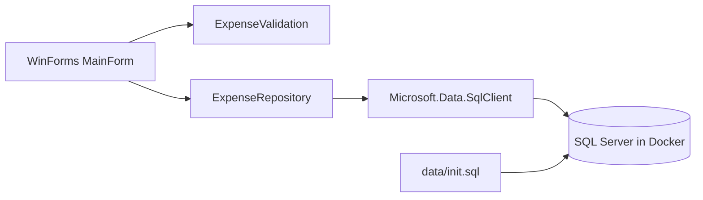

# Expense Tracker

## Overview

- WinForms desktop app for managing personal expenses.
- SQL Server runs in Docker for a repeatable Windows setup.
- The schema source of truth is [data/init.sql](data/init.sql); database files are not stored in Git.
- This is a portfolio project for local demonstration, not a production system with a server-side trust boundary.

The app helps a single local user track expenses by category, amount, date, and note. It supports adding categories and creating, viewing, editing, and deleting expenses; the table displays a total of the loaded expenses.

## What this project demonstrates

- C# and .NET 10 WinForms event-driven desktop UI.
- Separation between UI (`MainForm`), input rules (`ExpenseValidation`), and SQL access (`ExpenseRepository`).
- Parameterized SQL with explicit SQL types and `DECIMAL(18,2)` handling.
- SQL Server schema initialization, Docker Compose persistence, and repeatable Windows setup.
- Database-independent unit tests plus separately tagged local integration tests.

This is intentionally a small desktop portfolio project, not a web service or a production personal-finance platform.

## Requirements

- Windows 10/11
- Docker Desktop
- Git
- .NET SDK 10 when building from source

## Quick start

From the repository root, run setup. It prompts for the local SQL Server SA password without echoing it:

```powershell
powershell -NoProfile -ExecutionPolicy Bypass -File .\scripts\setup\setup-all.ps1
```

To start Docker and initialize the database without launching the app:

```powershell
powershell -NoProfile -ExecutionPolicy Bypass -File .\scripts\setup\setup-all.ps1 -RunApp:$false
```

The setup script starts SQL Server without force-recreating the container, waits for SQL readiness, and runs [data/init.sql](data/init.sql) only if `ExpenseDb` does not exist. It then creates or verifies a restricted `ExpenseApp` SQL login, builds, and optionally launches the WinForms app. The application credential is randomly generated and protected with Windows DPAPI for the current user at `%LOCALAPPDATA%\ExpenseTracker\app-db-password.bin`; the connection string is passed only to the app process. The SA password is used only by local setup and is not written to a batch file, connection file, or user-level environment variable. Use the same SA password on later runs. If the existing volume rejects it, stop and recover the correct password; do not delete the volume as a troubleshooting shortcut.

The application login is limited to `db_datareader` and `db_datawriter` in `ExpenseDb` instead of SQL Server administrator access. The database port is bound to `127.0.0.1`, not exposed to other machines on the network. The SQL Server volume is persistent. Setup preserves existing database contents and does not repair permissions or recreate the volume automatically.

## Reviewer demo

After setup, the main window loads categories and expenses automatically. A new database includes Food, Transport, Bills, and Other categories, but no fabricated expense history.

1. Select a category and enter a positive amount.
2. Add the expense and confirm it appears in the table and total.
3. Double-click the expense row, change a field, and click **Save Changes**. Press Escape to cancel editing.
4. Delete that expense and confirm the total updates.
5. Add a category, restart the app, and confirm the category persists.

For an interview walkthrough, explain the split between the WinForms UI, `ExpenseValidation`, `ExpenseRepository`, SQL Server, and the database initialization script. The repository deliberately remains a local single-user demo; it does not claim multi-user security.

### Architecture



`MainForm` owns layout, input binding, and the displayed total. `ExpenseValidation` handles amount/category input rules. `ExpenseRepository` owns parameterized SQL and explicit SQL types. `data/init.sql` creates the schema and adds starter categories only when the category table is empty.

Real screenshots or a screen recording are useful portfolio evidence, but should be captured from the running app; this repository does not include a generated/mock UI image.

## Run again

Run `setup-all.ps1` again with the same SA password to start the service and app. Starting Docker Compose alone will not pass the process-scoped connection to a manually launched app.

## Tests

Database-independent unit tests:

```powershell
powershell -NoProfile -ExecutionPolicy Bypass -File .\scripts\tests\run-unit-tests.ps1
```

Integration tests explicitly start the local Docker service and use only `ExpenseDb` on `localhost:1433`. The test refuses other connection targets:

```powershell
powershell -NoProfile -ExecutionPolicy Bypass -File .\scripts\tests\run-integration-tests.ps1
```

UI tests require an interactive Windows desktop and a reachable SQL Server. See [docs/TESTING_GUIDE.md](docs/TESTING_GUIDE.md) for prerequisites, rollback behavior, and manual QA. GitHub Actions runs restore, build, and database-independent tests only; wait for a successful workflow run before describing CI as green.

## Release bundle

The tracked ZIPs in `artifacts/` are historical bundles that still contain a hard-coded example database credential. Do not use or distribute them as the current demo; they are retained unchanged, and the release script refuses to overwrite them. For a current bundle, choose a new version:

```powershell
powershell -NoProfile -ExecutionPolicy Bypass -File .\scripts\setup\create-release.ps1 -Version "0.3.0"
```

The self-contained app still requires Docker Desktop because SQL Server runs in a container.
The currently tracked ZIPs predate the secure setup flow; use source setup for a current demo until a new versioned bundle has been generated and checked.

## Troubleshooting

- Docker is not running: open Docker Desktop.
- Port 1433 is occupied: stop the conflicting SQL Server or change the port consistently in `docker-compose.yml` and the connection string.
- SQL Server is not ready: inspect `docker logs expense-mssql`.
- If the app cannot connect, run setup again with the same SA password and check `docker compose logs mssql`. Do not use `docker compose down -v` as a troubleshooting step: it permanently removes local database data.
- If the DPAPI app credential cannot be decrypted, preserve the database volume. After confirming the SA password and current Windows user, remove only `%LOCALAPPDATA%\ExpenseTracker\app-db-password.bin` and rerun setup to create a replacement restricted login; this does not reset expense data.

## Structure

- `src/ExpenseTracker.WinForms`: WinForms UI, validation, and SQL repository.
- `src/ExpenseTracker.Tests`: validation, repository checks, and opt-in integration tests.
- `src/ExpenseTracker.UiTests`: interactive FlaUI smoke test.
- `data/init.sql`: database schema and safe starter categories.
- `scripts/setup`: Docker/setup and release helpers.
- `scripts/tests`: unit, integration, UI, and smoke-test entry points.
- `.github/workflows/dotnet.yml`: build and unit-test CI.

## Known limitations

- There is no account, authorization, or per-user ownership model yet.
- The desktop client connects directly to SQL Server. This is acceptable for a local demo, but it is not a production security boundary.
- The local application login is restricted to database reader/writer roles, but a desktop client can still be inspected and can access all rows in this single-user database. A real multi-user system needs a trusted server-side service and ownership checks on every operation.
- The DPAPI-protected application credential is tied to the Windows user/profile that created it. It is not a portable credential or production identity system.
- LocalDB/MDF fallback remains for compatibility; Docker is the documented primary path.
- The app supports create/read/update/delete for expenses and create/read for categories; it has no category edit/delete or reporting dashboard.
- The app currently uses a local SA connection for demonstration. This is not least-privilege credential design and is not suitable for a production deployment.
- There is no real screenshot/video asset in this repository yet; only add evidence captured from the actual running application.

## Repository hygiene

Do not commit `.env`, connection files, database binaries, build output, test results, logs, or passwords. Existing release ZIPs are retained for history but are not recommended as the current demo.
