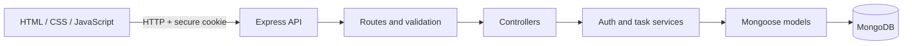

# Personal Task Manager

A full-stack task manager built to demonstrate practical backend, security, and
delivery skills—not just CRUD endpoints.

## Highlights

- User registration and login with usernames and passwords.
- Password hashing, HTTP-only same-site authentication cookies, rate limiting,
  and per-user task isolation.
- Task statuses, priorities, due dates, and tags.
- Search, status/priority/tag filters, sorting, and bounded pagination.
- Express routes/controllers/services/models, validation, and consistent errors.
- Automated API tests, ESLint, Prettier, GitHub Actions, and full-stack Docker.

## Architecture



## What Docker packages

The `Dockerfile` describes how to build an app image: it starts from a Node.js
runtime, installs the production dependencies from the lockfile, and copies in
the backend and browser files. Docker Compose then runs that app image beside a
MongoDB container, connects them on a private container network, waits for the
database health check, and keeps database files in a named volume. This is
repeatable packaging and local orchestration; it is not the same as publishing
the source code alone, and it does not automatically host the app online.

## Quick start

1. Install Git and Docker Desktop, then start Docker Desktop. The first run
   needs an internet connection to download the application and MongoDB images.
2. Clone the published version of this repository, open a terminal in
   `JavaScript_Trainning\project`, and run:

   ```powershell
   docker compose -f docker-compose.yml -f docker-compose.demo.yml up --build
   ```

3. Open <http://localhost:5000> and register an account.

No Node.js, `.env` file, or separate MongoDB installation is needed for the
local demo. The explicitly selected `docker-compose.demo.yml` supplies a
demo-only signing key and binds the app/database to localhost. Do not expose
this configuration publicly. The base `docker-compose.yml` does not supply a
secret: set a private `JWT_SECRET` of at least 32 characters before starting it
for any non-demo environment.

Use `docker compose -f docker-compose.yml -f docker-compose.demo.yml down` to
stop the services. Data remains in a named Docker volume. To delete local data
too, add `-v` to that command.

### Troubleshooting

- If Docker reports that port `5000` is already in use, stop the other app
  using that port, then rerun Compose.
- If the app starts before MongoDB is ready, wait for Compose to finish its
  database health check; the app starts after MongoDB is healthy.
- If the browser cannot connect, check that Docker Desktop is running and that
  both services are up:

  ```powershell
  docker compose -f docker-compose.yml -f docker-compose.demo.yml ps
  ```

See [the user guide](docs/HUONG_DAN_SU_DUNG.md) for local development, tests, and
legacy-data migration. API details are in [the API reference](docs/API.md).

CI checks pushes and pull requests. To build and publish a versioned container
to GitHub Container Registry after those checks, push a tag such as
`task-manager-v1.0.0`. This produces a deployable artifact; it does not deploy
to a cloud runtime.

## Demo walkthrough

There is no hosted demo yet. A concise local walkthrough:

1. Register two accounts in separate browser sessions.
2. Create tasks with different priorities, dates, tags, and statuses.
3. Search, filter, sort, and paginate the first account's tasks.
4. Confirm the second account cannot see or modify those tasks.

This flow demonstrates the main product and the authorization boundary without
requiring a seeded production database.

Use a normal browser window and a private/incognito window to try two separate
accounts on one computer. Each account should only see its own tasks.

## Screenshots


Captured from the local Docker demo; the data shown is sample-only.

## Verification artifacts

- [QA test report](docs/TEST_REPORT.md): test cases, execution results, and
  coverage summary.
- [HTML coverage report](backend/coverage/lcov-report/index.html): generated
  locally by `npm run test:coverage` (the generated report is git-ignored).
