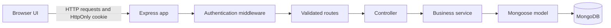

# Architecture and design

Personal Task Manager is a single-page browser application served by an Express
backend. MongoDB stores users and tasks. The `learning/` folder is separate from
this application.

## Request flow

- **Routes and validation** declare the HTTP contract and reject invalid input.
- **Middleware** applies security headers, request limits, authentication, and
  consistent error responses.
- **Controllers** translate HTTP requests and results.
- **Services** hold authentication, ownership, filtering, and persistence rules.
- **Models** define user/task data and database constraints.

## Authentication and ownership

Users choose a unique username and a password of at least 12 characters.
Passwords are stored as bcrypt hashes, never as plaintext. The API returns an
HTTP-only, `SameSite=Strict` cookie containing a signed token that expires after
7 days; the browser JavaScript cannot read the token. Logging out increments
the user's token version to immediately invalidate every session for that user,
not just the cookie in the current browser. The secret comes from `JWT_SECRET`
and must be at least 32 characters in production.

Every task has an `ownerId`. The task service scopes list, update, and delete
queries to the authenticated user. A task belonging to a different user appears
as not found, avoiding disclosure of its existence.

## Task model and API design

Tasks have a title, workflow status, priority, optional due date, tags, owner,
and timestamps. Lists are paginated (default 10, maximum 100), and can be
searched and filtered. Sort fields are allow-listed so arbitrary database
fields cannot be selected by query parameters.

See [API reference](./API.md) for endpoint details and response formats.

## Local data migration

Existing tasks created before authentication have no owner and are intentionally
not visible to new accounts. After creating the intended account, run the
explicit migration command described in the [user guide](./HUONG_DAN_SU_DUNG.md)
to assign legacy tasks to that account. Review the target username before
running it.

## Security and operational choices

- Helmet sets common HTTP security headers.
- JSON request bodies are limited to 10 KB.
- Login and registration have a stricter rate limit; the API also has a general
  request limit.
- Inputs are validated and updates accept only known task fields.
- CORS is not enabled because the browser UI and API are served from the same
  origin. Do not enable permissive CORS if deploying this configuration.
- Compose exposes MongoDB only on the local loopback interface.
- The base Compose configuration requires an explicitly supplied signing
  secret; the local demo override supplies a clearly demo-only key. Never use
  that override in a shared or public deployment.
- The local Compose setup is for demonstration/development, not a production
  deployment. Production needs managed secrets, TLS, database access controls,
  monitoring, backups, and a deliberate deployment environment.

## Verification

API integration tests use a temporary MongoDB instance and cover authentication,
password hashing, task CRUD, search/filter/pagination, validation, and user
isolation. Frontend interaction tests cover auth state, error feedback, and
date-only timezone rendering. CI runs tests and coverage reporting, lint, and
formatting checks.
